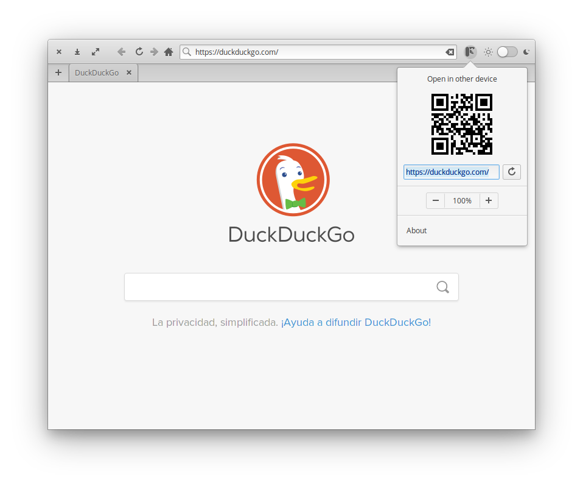
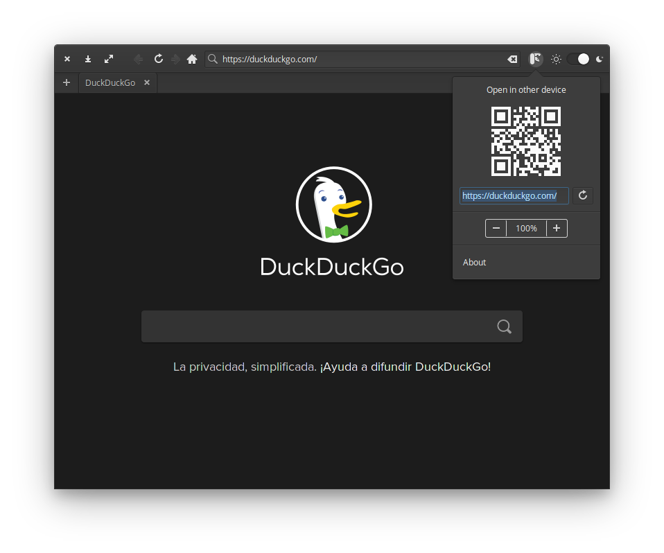

<p align="center">
  
</p>
<h1 align="center">Xana</h1>


| | 
|------------------------------------------|
|

A web browser made by and for developers 🤓️

## What? Another web browser? 🤔️

With this browser i try to make a tool that helps every web developer. Instead of need to install an unlimited number of plugins, how about if you only need to install one app.

For the moment this is a VERY, VERY (really VERY 😹️) simple web browser, as it's a work in progress.

It's based on Webkit, and inspired in other great browsers like [Midori](https://github.com/midori-browser?type=source)😻️ and [Ephemereal](https://github.com/cassidyjames/ephemeral)😻️.

Developed for [Elementary OS](https://elementary.io/es/).

## Contribute

This is a project that i'm going improve in my free time, if you think you can help the development, the pull request are open 🎉️

## Features

* Basic web browser
* QR generation of the current page, so you can open it in another device (tablet, mobile...)

## Things to do

This is a little list of features that i want to reach

### Most important

* Some other basic web browsers features like:
  * Favorites
  * History
  * Search directly in the URL entry
  * Change default search engine

### And then

* Make a preview view to see the web in 3 sizes (PC, tablet, mobile)
* "Native" JSON/XML viewer
* Some tool to test REST API
* Optional "clean exit" cleaning history, cookies...

## Dependencies

Ensure you have these dependencies installed

* valac
* glib-2.0
* gtk+-3.0
* webkit2gtk-4.0
* [qrencode](https://fukuchi.org/works/qrencode/)

## Install, build and run

libwebkit2gtk-4.0-dev

```bash
# FOR ELEMENTARY OS USERS
sudo apt install elementary-sdk

# FOR THE REST
sudo apt install cmake libgtk-3-dev gettext libwebkit2gtk-4.0-dev meson ninja-build

# install qrencode
sudo apt install qrencode

# clone repository
git clone https://github.com/sergius02/Xana Xana

# cd to dir
cd Xana

# run meson
meson build --prefix=/usr

# cd to build
cd build

# build
ninja

# install
sudo ninja install
```

## Credits

* [qrencode](https://github.com/fukuchi/libqrencode)

----------

If you like my work you can

<a href="https://www.buymeacoffee.com/sergius02" target="_blank"></a>
